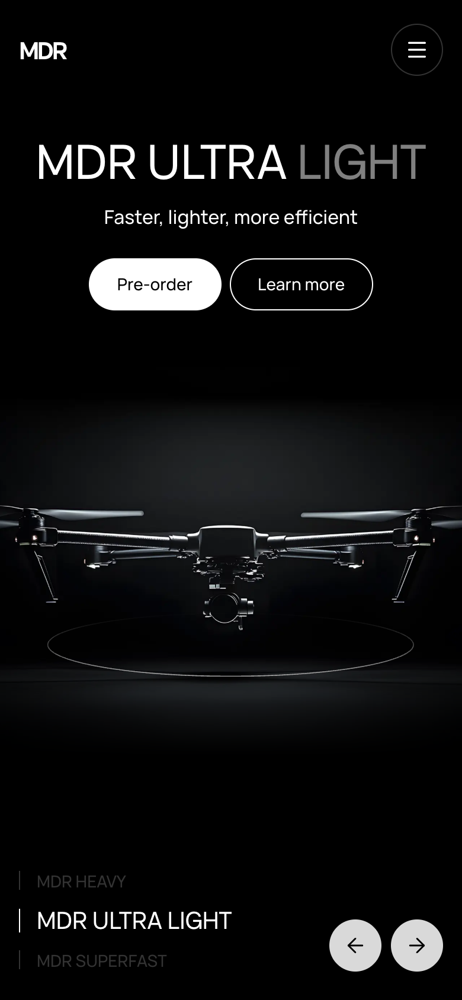
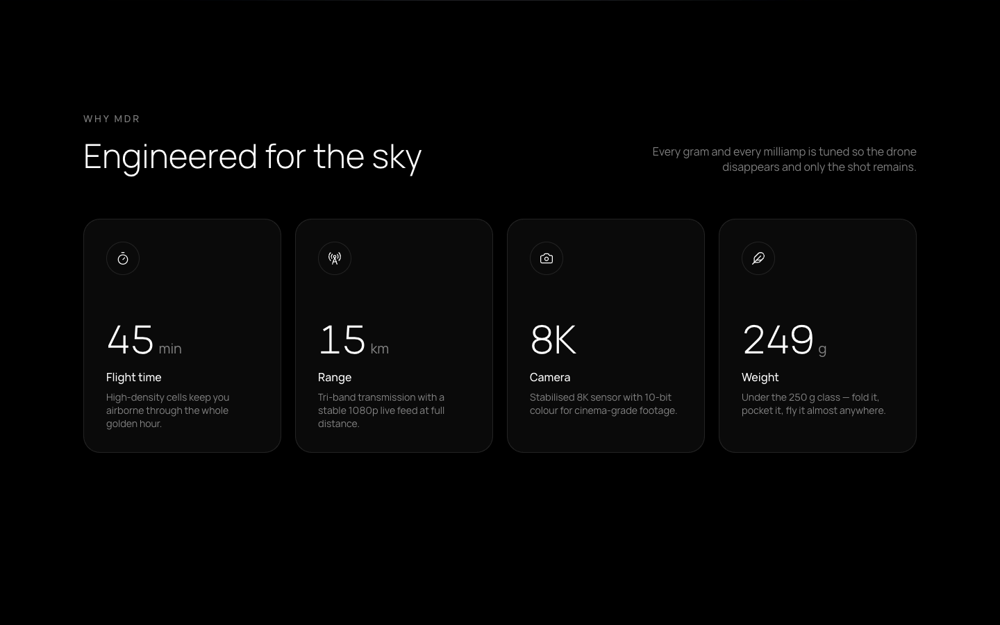
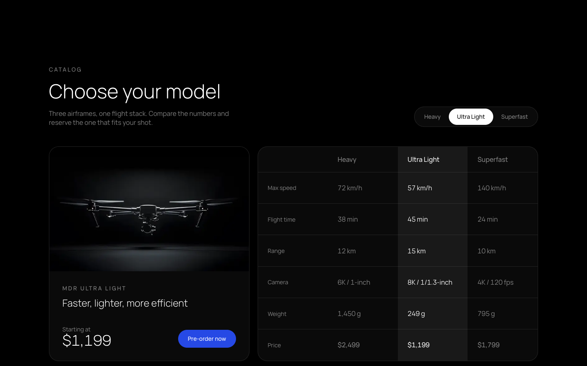
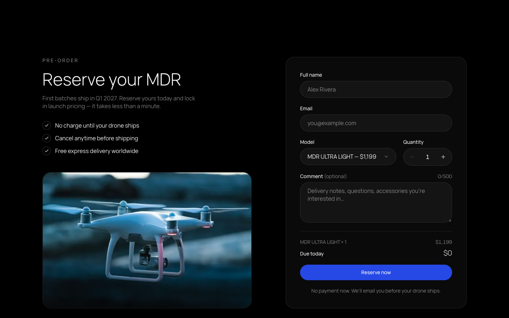

# MDR — premium drone landing page

Preview:
https://mdr-landing-nine.vercel.app/

A production-style landing page for a fictional drone brand, built as a
portfolio project. It covers the whole path of a pre-order: a Figma-based hero,
a model comparison fed by an API route, and a validated form that writes to
MongoDB and sends a confirmation email.

MDR is not a real company. All names, prices, reviews and contact details are
made up.

## Screenshots

| Desktop (1440px) | Mobile (390px) |
| ---------------- | -------------- |
|  |  |

| Key features | Model comparison | Pre-order form |
| ------------ | ---------------- | -------------- |
|  |  |  |

## Stack

- [Next.js 16](https://nextjs.org) (App Router, Turbopack) and React 19
- TypeScript in strict mode
- Tailwind CSS v4 with design tokens in `@theme`, SCSS modules for complex styles
- Framer Motion for the slider, tabs and scroll-reveal animations
- react-hook-form and zod, with one schema shared by the client and the API
- MongoDB through Mongoose
- Resend for transactional email

## Features

- **Hero slider** — three drone models, switched with arrows, the model list,
  swipe or the keyboard; mouse parallax on desktop.
- **Key features** — numbers count up when the section scrolls into view.
- **Model comparison** — pill tabs with an animated indicator and a real
  `<table>`. Data comes from `GET /api/models`. "Pre-order now" scrolls to the
  form with the active model preselected, and the selection is kept in the URL
  (`?model=superfast#preorder`), so it can be shared and works without
  JavaScript.
- **Testimonials** — scroll-snap slider on phones, grid on desktop.
- **Pre-order form** — client and server validation from the same zod schema,
  loading, success and error states, accessible labels and error messages.
- **FAQ** — WAI-ARIA accordion with full keyboard support.
- **Newsletter** — unique emails, with a friendly message for a repeated
  subscription.
- **Spam protection** — per-IP rate limiting and a honeypot field on both
  forms.
- **Accessibility and motion** — semantic HTML, visible focus states, and all
  animation respects `prefers-reduced-motion`.
- **SEO** — metadata, Open Graph and Twitter cards, a generated social image
  and icons, `robots.txt` and `sitemap.xml`.

## Getting started

Requires Node.js 20.9 or newer.

```bash
npm install
cp .env.example .env.local
npm run dev
```

Open [http://localhost:3000](http://localhost:3000).

The app runs with an empty `.env.local`. Without a database or an email key
the forms still work: the payload is printed to the server console.

### Scripts

| Command         | What it does                         |
| --------------- | ------------------------------------ |
| `npm run dev`   | Start the development server         |
| `npm run build` | Create a production build            |
| `npm run start` | Serve the production build           |
| `npm run lint`  | Run ESLint                           |

## Environment variables

All of them are optional. See `.env.example`.

| Variable         | Used for                                                   | When it is missing                                         |
| ---------------- | ---------------------------------------------------------- | ---------------------------------------------------------- |
| `MONGODB_URI`    | Saving pre-orders and newsletter subscribers               | Payloads are logged to the server console                  |
| `RESEND_API_KEY` | Pre-order confirmation emails                              | The email is logged to the server console                  |
| `RESEND_FROM`    | Sender address on a domain verified in Resend              | `onboarding@resend.dev` is used                            |
| `SITE_URL`       | Absolute URLs in metadata, `robots.txt` and `sitemap.xml`  | The Vercel production domain, or `http://localhost:3000`   |

Mongoose creates the `preorders` and `subscribers` collections and their
indexes on first use, so there are no migrations to run.

To try the database path locally:

```bash
mongod --dbpath ./local-database --port 27017
```

and set `MONGODB_URI="mongodb://127.0.0.1:27017/mdr"` in `.env.local`.

## API

| Route                  | Description                                                              |
| ---------------------- | ------------------------------------------------------------------------ |
| `GET /api/models`      | The three models with their specs                                        |
| `POST /api/preorders`  | Validates and saves a pre-order, then sends the confirmation email       |
| `POST /api/newsletter` | Saves a subscriber; a repeated email gets a friendly answer, not an error |

Both `POST` routes answer `422` for invalid input and `429` after five
requests in ten minutes from one IP address. The rate limiter lives in memory,
so on serverless hosting it works per instance.

## Project structure

```
src/
  app/          Routes, layout, metadata files and API route handlers
  components/
    layout/     Header and Footer
    sections/   One folder per page section
    ui/         Reusable components: Button, Card, Tabs, Accordion, form fields
  data/         Page content and the single source of model data
  lib/          Validation schemas, model selection, server-only modules
  styles/       Shared SCSS partials
  types/        Shared domain types
```

Every component lives in its own folder with an `index.tsx`, its types and its
styles.

## Drone images

The hero reads `public/drones/heavy.png`, `ultra-light.png` and
`superfast.png`. A model without a file gets a styled placeholder. Image
availability is checked at build time, so rebuild after adding a file.

## Deployment

The project deploys to [Vercel](https://vercel.com) without extra
configuration:

1. Import the repository in Vercel.
2. Add `MONGODB_URI`, `RESEND_API_KEY` and `RESEND_FROM` in the project
   settings.
3. Deploy. `SITE_URL` is only needed when the site should use a domain other
   than the Vercel production domain.
